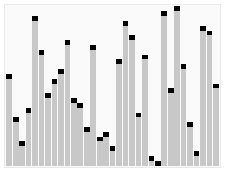

#Quicksort
Quicksort (sometimes called partition-exchange sort) is an O(n log n) efficient sorting algorithm, serving as a systematic method for placing the elements of a random access file or an array in order.
##How does it work?
Quicksort works by picking an element from the array and denoting it as the “pivot.” All other elements in the array are split into two categories — they are either less than or greater than this pivot element.

Each of the two resulting arrays (array of values less-than-the-pivot and array of values greater-than-the-pivot) is then put through that very same algorithm. A pivot is chosen and all other values are separated into two arrays of less-than and greater-than values.

Eventually, a sub-array will contain a single value or no value at all, as there will be no more values with which to compare it. The rest of the values were all denoted to be “pivots” at some previous point and did not trickle down to this lowest sub-array. At that point, the values will be sorted, as all values have now been declared as less than or greater than all other values in the array.

